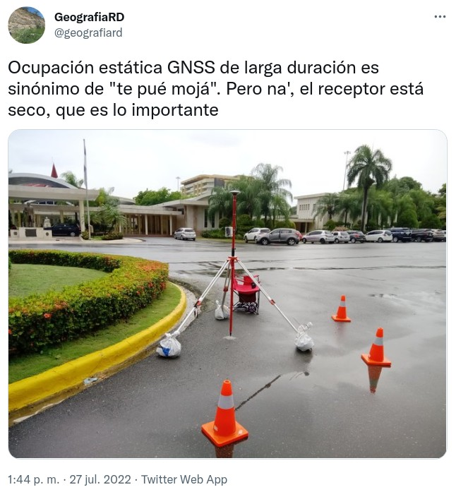

```{r setup, include=FALSE}
knitr::opts_chunk$set(echo = FALSE)
```

# INTRODUCCIÓN: ANTECEDENTES Y PROBLEMA DE INVESTIGACIÓN, SOLUCIONES

## Antecedentes y problema de investigación

## 

## Estudio precedente por medio de InSAR-SBAS

- Al menos cuatro áreas de la ciudad con fuertes señales de alejamiento en la línea de observación del sensor; barrios densamente poblados de la llanura de inundación del río Ozama.

- Una señal muy intensa y concentrada en área pequeña, próximo a cañada, sector Las Malvinas.

- Las velocidades de alejamiento máximas obtenidas fueron de ~60 mm/año, con valores promedio de ~40 mm/año.

## {width=60%}

## 

## 

##

<iframe width="100%" height="600" src="https://geofis.xyz/lm/index.php/view/map/?repository=sbassd1618&project=lizmap" frameborder="0" allow="accelerometer; autoplay; encrypted-media; gyroscope; picture-in-picture" allowfullscreen="" data-external="1"></iframe>

<span style="font-size:60%;">[https://geofis.xyz/lm/index.php/view/map/?repository=sbassd1618&project=lizmap](https://geofis.xyz/lm/index.php/view/map/?repository=sbassd1618&project=lizmap)</span>

## 

<span style="font-size:60%;">[https://geofis.xyz/lm/index.php/view/map/?repository=sbassd1618&project=lizmap](https://geofis.xyz/lm/index.php/view/map/?repository=sbassd1618&project=lizmap)</span>

## {width=65%}

## La señal en el sector Las Malvinas, es atribuible a **asentamiento de materiales de relleno de cañada**.


## 

## Soluciones de hardware

##

- Trimble, Leica, Topcon, NovAtel, JAVAD, ...

- u-blox, Septentrio, Skytraq, ComNav Technology ...

## {width=85%}

## 

## 

## Aplicaciones

* Monitoreo de __deslizamientos, fallas__.

* Mensura.

* Fotogrametría con __UAV__.

* Construcción, monitoreo de __edificaciones y estructuras__ (puentes)

* __Agricultura__ de precisión.

* Detección de __tsunamis__ por boyas GNSS.

* Sistemas de __transporte__, vehículos autónomos.

* Sistemas de cartografía __móviles__ (Street View).

```{r, eval = F}
knitr::knit_exit()
```

# MATERIALES Y MÉTODOS

## HARDWARE <span style="font-size:60%;">Partes adquiridas para equipo de colecta (Financiamiento: "SALARIO-CyT")</span>

| Parte                                                                         | Costo aprox.|
|-------------------------------------------------------------------------------|------------:|
| Base o rover, los imprescindibles: receptor, RPi, antena.                     |    US$340   |
| Adaptador de corriente, palo, trípode, conectores, cables, carcasa, batería   |    US$240   |

<span style="font-size:60%; float:left;">- No se incluyen fletes.</span>

## 

## 


## Software

- GAMIT/GLOBK es un paquete de análisis de GNSS desarrollado en el MIT, el Centro para Astrofísica Harvard-Smithsonian (CfA), el Instituto Scripps de Oceanografía (SIO) y la Universidad Nacional Australiana, para estimar las coordenadas y velocidades de las estaciones de observación, representaciones estocásticas o funcionales de la deformación postsísmica, retrasos atmosféricos, órbitas de los satélites y parámetros de orientación de la Tierra.

## Software

* Fork propio de RTKBase para usarlo:
    * __En la base__.
    * También __en el rover__, pues tiene capacidad de envíar correcciones RTCM3 a receptor.

## {width=75%}

- https://github.com/geofis/rtkbase

## 

# RESULTADOS

## 

## {width=50%}

## {width=50%}

## 

## 

## 

## 

## 

# REFERENCIAS

<section style="font-size: 24px; text-align: left;">